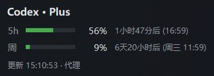

# codex-quota-widget

A tiny always-on-top floating widget for Windows that shows your
[OpenAI Codex](https://openai.com/index/introducing-codex/) (ChatGPT plan)
usage in real time: the **5-hour window** and the **weekly window** quotas,
with progress bars and reset countdowns.

Unofficial tool — it only reads the same usage endpoint that the Codex CLI
itself uses. Not affiliated with OpenAI.

## Features

- **5h & weekly quota** — used percentage, color-coded bar (green < 70%,
  orange < 90%, red ≥ 90%) and a live reset countdown ("1小时47分后 (16:59)"
  = 1h47m left, resets at 16:59).
- **Zero dependencies** — pure Python standard library (tkinter + curl).
- **Set-and-forget auth** — re-reads `~/.codex/auth.json` on every poll, so
  when the Codex CLI refreshes its token the widget just follows along. No
  separate login, ever.
- **Drag to move** anywhere; **drag edges/corner to resize** (font, bars and
  padding scale together, 0.75×–3×); **double-click** to collapse to one line;
  **right-click** menu (refresh now / follow / pinned follow / remaining /
  collapse / quit).
- **Follow mode** — right-click → "跟随 Codex 窗口" (follow Codex window):
  the widget docks into the Codex window's title bar — DPI-aware, also fits
  maximized/snapped windows — and switches to a compact one-line layout.
  When no Codex window is visible (closed or minimized) the widget hides
  itself; it pops back and re-docks the moment Codex reappears. It also
  steps aside while you drag the Codex window or when another window
  covers it, and returns as soon as you let go / uncover it.
- **Pinned follow** — right-click → "固定跟随" (pinned follow; exclusive
  with title-bar follow). The widget keeps the full layout and shares
  follow mode's hide, drag-aside, and uncover behavior; occlusion is
  judged on the widget's own area. Turning it on places the widget at
  the default spot: lower-left of the Codex window, a short gap above
  the avatar. Two slots are remembered separately. While Codex is a
  normal window the widget follows its moves and small resizes, and
  dragging re-pins that slot. The first time Codex is maximized the
  widget returns to the default spot, and later drags while maximized
  are kept on their own. Restoring the window returns to the
  normal-window slot. Double-click collapse stays anchored on the title.
- **Used / remaining display** — right-click → "显示剩余额度" (show remaining)
  flips numbers and bars to the remaining quota; warning colors always track
  usage, so "8% remaining" still reads red.
- **Tray icon** — left-click recovers the widget whenever it is hidden or
  stuck; right-click offers recover / refresh now / quit, so the widget can
  always be closed even when invisible.
- **DPI-sharp text** — declares Per-Monitor DPI awareness, so it stays crisp
  on 125%/150% scaled displays instead of being bitmap-stretched.
- Auto-refresh every 60 s; countdowns re-render every 30 s.

## Requirements

- Windows 10 / 11
- Python 3.8+ with tkinter (any normal Windows Python install)
- `curl.exe` — already built into Windows; no install needed
- A ChatGPT plan with Codex access, logged in via `codex` CLI at least once
  (that's what creates `~/.codex/auth.json`)

## Setup

1. Download `codex_quota_widget.pyw` and `start_widget.bat` into any folder.
2. Double-click `start_widget.bat` (or the `.pyw` directly). The widget
   appears near the bottom-right corner.
3. Optional — autostart: Win+R → `shell:startup` → put a shortcut to
   `start_widget.bat` there.

## How it works (and why curl is involved)

Every 60 seconds the widget:

1. reads the ChatGPT access token + account id from `~/.codex/auth.json`
   (created when you log in with the Codex CLI — the file never leaves your
   machine and the token is only ever sent to `chatgpt.com`), then
2. calls `GET https://chatgpt.com/backend-api/codex/usage` and renders
   `rate_limit.primary_window` (5h) / `secondary_window` (weekly):
   `used_percent`, `reset_at`, `limit_window_seconds`.

Two gotcha's we hit, documented in case you fork this:

- **Python's own TLS stack gets blocked** by chatgpt.com's Cloudflare with
  403 (TLS fingerprinting). Shelling out to the OS `curl.exe` (Schannel)
  works reliably.
- Do **not** add curl's `--ssl-no-revoke` flag — it alters the Schannel
  handshake in a way that also gets 403'd. Plain curl succeeds.

Networking tries `http://127.0.0.1:7897` (Clash default) first and falls
back to a direct connection — set the `CODEX_WIDGET_PROXY` environment
variable to override (`direct` to force direct). If the proxy isn't running,
the failed attempt is instant (connection refused), so the fallback is cheap.

## Configuration

| What | How |
| --- | --- |
| Proxy | `CODEX_WIDGET_PROXY` env var (default `http://127.0.0.1:7897`, `direct` = direct only) |
| Refresh interval | edit `POLL_SECONDS` at the top of the script |
| Debug log | run with `--debug` → writes `widget.log` next to the script |

## Build (optional)

A standalone, install-free exe can be produced with PyInstaller — icon and
spec live in `packaging/`, output lands in `app/`:

    python -m PyInstaller --onefile --noconsole --icon="<abs path>/packaging/app.ico" \
        --name CodexQuotaWidget --distpath app --workpath build \
        --specpath packaging codex_quota_widget.pyw

Note: the icon path must be absolute (relative paths resolve against the
spec directory). The exe is unsigned, so SmartScreen may ask on first run
("More info" → "Run anyway").

## Troubleshooting

- **Title shows ⚠ / error in the status line** — hover text shows the last
  error; the next poll retries automatically. `HTTP 401` means your token
  expired: run `codex` once to refresh, the widget picks up the new token by
  itself.
- **`--` on a row** — the server didn't return that window (e.g. new account);
  it will fill in once data appears.
- **Window won't move** — grab the title row ("Codex · Plus") and drag.

## License

[MIT](LICENSE)
